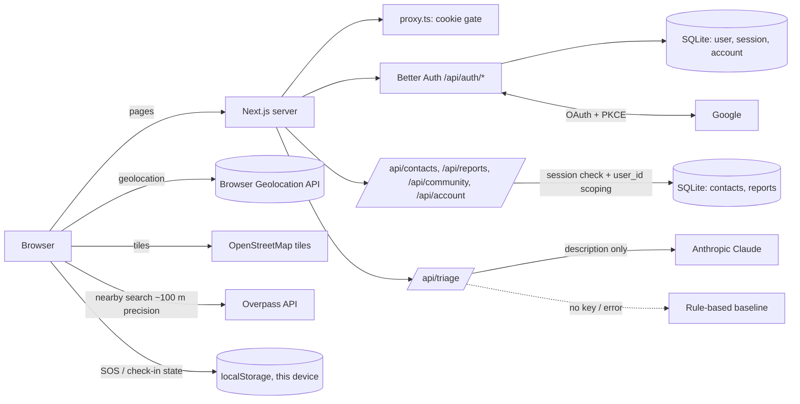

# SafeSphere — Implementation Report

Sankalp Setu Student AI Hackathon · Seva Sankalp Abhiyan
Theme: **Safety, Disaster Management & Community Resilience**
Report date: 1 October 2026

---

## A. Executive summary

| | |
|---|---|
| **Project** | SafeSphere — "Safety, within reach." |
| **Problem** | In the first minutes of an emergency, people lose time remembering numbers, describing their location and contacting the right people. Local hazards (flooding, open drains, unsafe spots) are shared as scattered, unverified chat messages. |
| **Intended users** | Students and commuters, people travelling alone or at night, tourists, elderly people and their families, and community volunteers. India-first (112 and national helplines). |
| **Main features** | Confirmed SOS (112 call + shareable message with real coordinates), live location with start/stop, trusted contacts, timed check-ins, incident reports with AI-assisted categorisation, opt-in anonymised community feed, nearby help (OpenStreetMap), offline emergency and disaster-preparedness guidance, data export/deletion. |
| **Public-service value (intended)** | Shortens the path to 112 and trusted people, makes location easy to share, and turns community observations into structured, clearly *unverified* reports. SafeSphere complements emergency services; it does not replace or impersonate them. |

The value described above is a design goal. **No real-world impact has been measured**; section N lists how a pilot would measure it.

## B. Problem statement

1. **Lost minutes.** Under stress, people struggle to recall which number to dial (112, 108, 101), who to call, and how to describe where they are.
2. **Location is hard to communicate** in unfamiliar places. Coordinates or a map link are more precise than a landmark, but few people know how to share them quickly.
3. **Community hazard information is unstructured.** Reports of flooding, live wires or harassment hotspots circulate in chat groups without categories, timestamps or any signal of whether they are verified.
4. **Preparedness knowledge isn't at hand.** Basic first-aid and disaster steps are rarely available in short, plain language when they're needed.

SafeSphere puts these tools in one place. It **does not** detect danger, verify reports, predict disasters, or contact anyone automatically.

## C. Target users and needs

| User | Need | SafeSphere response |
|---|---|---|
| Student / commuter travelling alone | Someone should know if they don't arrive | Timed check-in, live location share, SOS message |
| Person in an emergency | Call the right number fast and say where they are | SOS → Call 112, coordinates + map link ready to copy/share |
| Family member / trusted contact | Receive clear, actionable info | Pre-written SOS message with time, coordinates, map link |
| Resident / volunteer | Record and see local hazards | Structured reports, opt-in anonymised community feed |
| Anyone (no account) | Know what to do first | Public `/guidance` page with 7 topics |

## D. Solution and user workflow

1. **Landing (`/`)** → concise feature overview, community safety explanation, privacy principles. Public guidance at `/guidance`, privacy notice at `/privacy`.
2. **Sign up / log in (`/signup`, `/login`)** with email + password or Google (when configured). Already-signed-in users are redirected to the dashboard.
3. **Dashboard (`/dashboard`)**, server-protected:
   - Status banner showing real state only (SOS / check-in / location / contacts).
   - SOS → confirmation dialog → active SOS with **Call 112**, coordinates, message to copy/share/SMS-draft, and "I'm safe — end SOS".
   - Check-in timer (5/15/30 min or custom), countdown, "I'm safe", extend, cancel, overdue alert with dismiss.
   - Location: start/stop live location, map, nearby help via OpenStreetMap, Google Maps search links.
   - Trusted contacts: add/edit/delete, call, copy.
   - Incident reports: describe → optional AI suggestion → choose category → optional location → optional anonymous sharing → save; edit/delete later.
   - Insights from the user's own reports; community feed of shared reports; guidance; export/delete data or account.

## E. Features and implementation status

| Feature | Description | Relevant files | Status | How it was tested | Known limitations |
|---|---|---|---|---|---|
| Landing page | Hero, 8 features, 3 steps, community safety (unverified vs official), privacy, CTA, footer | `src/app/page.tsx`, `src/components/site/site-chrome.tsx` | Implemented | Browser screenshots at 375/430/768/1366 px, overflow check | Hero preview is illustrative (labelled) |
| Email/password auth | Sign up, log in, remember-me, sign out, validation | `src/lib/server/auth.ts`, `src/components/auth/auth-form.tsx`, `src/app/api/auth/[...all]/route.ts` | Implemented | API tests (sign-up, duplicate, wrong password, session cookie flags, sign-out) + browser signup flow | No email verification or password reset (no email service configured) |
| Google OAuth | "Continue with Google" via Better Auth | same as above | **Requires credentials** | With dummy credentials: verified the redirect to `accounts.google.com` has the correct `redirect_uri`, scopes `openid email profile`, `prompt=select_account` and PKCE (S256). Without credentials the button is disabled with an explanation. | **Not verified end-to-end** (no real Google client in this environment) |
| Route protection | Proxy cookie gate + server-side session check on `/dashboard` and every API route | `src/proxy.ts`, `src/app/dashboard/page.tsx`, `src/lib/server/api.ts` | Implemented | API tests: no cookie → `/login`; forged cookie → `/login?reason=expired`; all private APIs → 401 | — |
| Per-user authorization | All queries scoped by `user_id` | `src/lib/server/records.ts` | Implemented | API tests: user B cannot list/edit/delete user A's contacts or reports (404) | — |
| SOS | Confirm dialog, timestamp, background geolocation, message, copy/share/WhatsApp/SMS draft, tel:112, end SOS | `src/components/dashboard/sos-panel.tsx`, `dashboard.tsx` | Implemented | Browser flow: SOS activated, message contained real (test) coordinates | Never contacts anyone automatically; SOS state is per-device |
| Location sharing | `watchPosition` start/stop, accuracy, denied/unavailable/timeout messages, cleanup on unmount | `src/lib/use-geolocation.ts`, `location-panel.tsx`, `safety-map.tsx` | Implemented | Browser flow with granted permission and a synthetic coordinate | "Sharing" = visible on this screen + copy/share link; no server-side live tracking |
| Nearby help | Overpass (OSM) search within 5 km for hospitals/police/fire/pharmacy; Google Maps search links incl. relief shelters | `location-panel.tsx` | Implemented | Code path reviewed; live Overpass call depends on public service availability | OSM data may be incomplete; distances are straight-line |
| Trusted contacts | CRUD, validation, duplicates, click-to-call, copy | `contacts-panel.tsx`, `src/app/api/contacts/**` | Implemented | API tests + browser add (invalid phone rejected first) + persistence after reload | Max 10; contacts are not notified |
| Check-in timer | Presets + custom (1–240 min), countdown, I'm safe, extend, cancel, overdue alert + dismiss, tab title alert, survives refresh | `checkin-panel.tsx`, `dashboard.tsx` | Implemented | Browser: started, persisted across reload | Expiry alerts only this device; no notification to others |
| Incident reports | Category, description (10–2000 chars), timestamp, optional location, edit/delete, details, "Unverified" label | `reports-panel.tsx`, `src/app/api/reports/**`, `src/lib/validation.ts` | Implemented | API validation + authorization tests; browser create flow | No moderation workflow |
| Community feed | Opt-in shared reports, last 7 days, no author identity, location rounded to 2 decimals (~1 km) | `community-panel.tsx`, `src/app/api/community/route.ts` | Implemented | API test checks anonymity + rounding + unshare | Unmoderated; descriptions are user text |
| AI incident assist | Suggested category, summary, extracted fields, urgent cues, confidence, uncertainty; user applies or overrides | `src/app/api/triage/route.ts`, `src/lib/triage.ts` | Implemented; **Claude path requires `ANTHROPIC_API_KEY`** | Rule-based path: 17 unit tests + API test + browser flow. Claude path: type-checked, not called in this environment (no key) | See section F |
| Insights | Category counts, assistant usage, suggestion kept vs corrected — from the user's real reports only | `insights-panel.tsx` | Implemented | Browser screenshot | Personal, not community-wide statistics |
| Emergency guidance | 7 topics: do now / avoid / prepare / numbers / official-instructions reminder; public and in dashboard | `src/lib/guidance.ts`, `src/components/guidance/guidance-browser.tsx`, `src/app/guidance/page.tsx` | Implemented | Screenshots; keyboard tabs pattern | Must be reviewed by qualified responders before real use |
| Privacy controls | Export JSON, delete contacts/reports, delete account | `data-panel.tsx`, `src/app/api/account/route.ts` | Implemented | API tests (export scoped, delete data, delete account → session invalid) | — |
| Privacy notice | Plain-language data, location, AI, community and limits | `src/app/privacy/page.tsx` | Implemented | Screenshot | Not a legal document |

## F. AI implementation

### Runtime AI (inside SafeSphere)

| Item | Detail |
|---|---|
| Provider / model | Anthropic Claude via the official `@anthropic-ai/sdk`. Default model `claude-opus-5-5` (override with `SAFESPHERE_AI_MODEL`). |
| Where it runs | Server-side only, in the Next.js route `POST /api/triage`. The API key never reaches the browser. |
| When it runs | Only when a signed-in user presses **Suggest category** in the report form. Never during SOS, calling, location or check-in. |
| Input sent | The incident description text only (10–2000 chars). **No** name, email, user id, contacts or coordinates. |
| Output | Structured JSON validated against a zod schema (`messages.parse` + `zodOutputFormat`): `suggestedCategory` (one of 8 fixed categories), `confidence` (low/medium/high, the model's own qualitative rating), up to 2 alternatives, neutral one-sentence summary, extracted fields (what/where/when/people/hazards), `urgentCues`, `uncertainty`, `rationale`. |
| Guardrails in the prompt | No diagnosis, blame, or predictions about people/places; no invented details; no protected-trait descriptions; user text treated as data, not instructions. |
| Validation | Request: zod length limits. Response: schema-constrained output; refusals or unparseable output fall back to the baseline. Per-user rate limit (20/min). 12 s timeout, 1 retry. |
| User control | Suggestion is displayed with source, confidence, reasoning and uncertainty. The user applies it, chooses an alternative, or picks any category. The saved report records what was suggested and whether it was accepted. |
| Urgent cues | If the text contains phrases like "not breathing" or "fire spreading", the form shows a **Call 112** prompt. This is phrase spotting, not risk prediction. |
| When AI is unavailable | No key, API error, timeout, or refusal → the **rule-based keyword baseline** runs and is labelled **"Rule-based baseline · not AI"** with the reason. If the server is unreachable, the same baseline runs in the browser. |
| Logging | The route logs only the error class on failure, never the description. |

**Rule-based baseline (not AI).** `src/lib/triage.ts` is a transparent keyword scorer (multi-word phrases weigh double), plus regexes for where/when/people. It cannot understand negation or context, and the UI says so. Its confidence label comes from keyword margins, not a model.

**This environment:** no `ANTHROPIC_API_KEY` was configured, so every test exercised the **baseline** path. The Claude path compiles and type-checks against the installed SDK but **was not executed**.

**Demo data:** all testing used synthetic accounts (`@example.test`) and a synthetic coordinate (Panaji, Goa). No real personal data was used.

### AI used during development

This implementation was produced with an AI coding assistant (Claude Code, Anthropic), which inspected, wrote and tested the code under the team's direction. Disclose this to the judges according to the hackathon's rules.

## G. Architecture

- **Frontend:** Next.js 16 App Router, React 19, TypeScript, Tailwind CSS v4, Lucide icons, Inter (self-hosted via `next/font`).
- **Backend:** Next.js route handlers (Node runtime).
- **Authentication:** Better Auth 1.7 (email/password with scrypt hashing; Google OAuth with PKCE). Server-side sessions in SQLite; httpOnly, SameSite=Lax cookie (Secure on HTTPS). 7-day sessions; "Keep me signed in" off → browser-session cookie.
- **Database:** SQLite via Node's built-in `node:sqlite` (no native build). Better Auth tables (`user`, `session`, `account`, `verification`) are created automatically on first request. App tables `contacts` and `reports` are scoped by `user_id`.
- **Device-local state:** SOS and check-in state in `localStorage`, keyed by user id. Live location is held in memory only.
- **Maps:** Leaflet + OpenStreetMap tiles (attributed); Overpass API for nearby facilities (position rounded to ~100 m before sending).
- **AI:** Anthropic Messages API from `/api/triage`, with a deterministic fallback.



### Data model

| Table | Columns (app-owned) |
|---|---|
| `contacts` | `id`, `user_id`, `name`, `phone` (normalised), `relation`, `created_at`, `updated_at` |
| `reports` | `id`, `user_id`, `category`, `description`, `created_at`, `updated_at`, `lat`, `lng`, `accuracy` (optional), `assist` (JSON: engine, suggestion, confidence, summary, accepted), `shared` (0/1) |

## H. Hackathon evaluation mapping

No self-scores are given; this maps evidence and gaps to each criterion.

| Criterion | Evidence | Gaps / improvements |
|---|---|---|
| **Public-service relevance (25)** | Directly addresses emergency response (SOS → 112), disaster preparedness (flood/weather/earthquake guidance), public safety (check-ins, location) and community resilience (structured, opt-in hazard reports). India-specific numbers; clear "not an emergency service" positioning. | No field validation with users yet; guidance not yet reviewed by responders; English only. |
| **Prototype & feasibility (25)** | Working end-to-end: real auth, server persistence, authorization, geolocation, maps. Lint, typecheck, build pass; 17 unit + 27 API integration tests; browser flow at 4 viewports. Mainstream, low-cost stack. | Google OAuth and the Claude path need credentials to demo; SQLite suits a single server only. |
| **Innovation & use of AI (20)** | AI turns free text (including Hinglish words) into a structured, reviewable report with uncertainty and urgent-cue prompts; human-in-the-loop correction is recorded, giving a built-in accuracy signal. | Claude path not demonstrated without a key; no evaluation set yet; no clustering of similar reports. |
| **Scalability & adoption (15)** | Browser-based, no install; stateless route handlers; Better Auth supports Postgres/libSQL for scale-out; modular panels; per-user data model ready for moderators. | Needs a hosted DB, a shared rate-limit store, an SMS/notification gateway and an i18n layer before a district pilot. |
| **Responsible AI (10)** | Opt-in AI, minimal data sent, labelled source and uncertainty, deterministic labelled fallback, no diagnosis or predictions, "Unverified" everywhere, anonymised sharing, export/delete, privacy notice. | No formal bias evaluation; community feed has no moderation. |
| **Presentation (5)** | Consistent white UI, concise copy, demo script and slide outline below. | Record a backup demo video in case of network or permission issues. |

## I. Privacy and responsible AI

- **Location:** requested only on user action (live location, locate once, SOS, attach to report, nearby search). The status is always visible, and **Stop sharing** clears the watcher. Watchers are cleared on unmount and sign-out. Location is never stored server-side unless the user attaches it to a report.
- **Storage:** account, contacts and reports in the server DB, scoped per user. SOS and check-in state stay on the device.
- **Authentication:** server-verified sessions on every private page and API route; passwords hashed by Better Auth; rate limiting on auth routes; no secrets in client code.
- **User-submitted reports:** always labelled **Unverified**. Never sent to authorities. Community sharing is opt-in, anonymised, and shows a coarse ~1 km area.
- **AI limitations:** suggestions can be wrong. The keyword baseline can't understand negation. The model can misread mixed-language text. Users always choose the final category.
- **Demo data:** use test accounts and synthetic incidents only.
- **Compliance:** no formal legal or security compliance assessment has been done.

## J. Setup and execution

Requires **Node.js 22.13+** (uses the built-in `node:sqlite`; developed on Node 26).

```bash
cd safesphere
npm install                       # install dependencies
cp .env.example .env.local        # then edit values (see K)
npm run dev                       # http://localhost:3000

# quality checks
npm run lint
npm run typecheck
npm test                          # unit tests (no server needed)

# production build + run
npm run build
npm start

# API integration tests (against a running server; use a throwaway DB)
SAFESPHERE_DB_PATH=/tmp/ss-test.db BETTER_AUTH_URL=http://localhost:3100 npx next start -p 3100 &
BASE_URL=http://localhost:3100 npm run test:api
```

There is no separate backend; API routes run inside Next.js. The SQLite file is created automatically at `./data/safesphere.db` (git-ignored).

### Google OAuth setup

1. In [Google Cloud Console](https://console.cloud.google.com/), create or select a project.
2. **APIs & Services → OAuth consent screen:** choose External, set the app name (SafeSphere), support email, and scopes `openid`, `email`, `profile`. Add test users while the app is in Testing mode.
3. **Credentials → Create credentials → OAuth client ID → Web application.**
4. **Authorized JavaScript origins:** `http://localhost:3000` (and your production origin, e.g. `https://safesphere.example.org`).
5. **Authorized redirect URIs (exact):** `http://localhost:3000/api/auth/callback/google` and `https://<your-domain>/api/auth/callback/google`.
6. Put the client ID and secret in `.env.local` as `GOOGLE_CLIENT_ID` / `GOOGLE_CLIENT_SECRET`, and restart the server. The Google button enables automatically.
7. For production, set `BETTER_AUTH_URL=https://<your-domain>` and a new `BETTER_AUTH_SECRET`, add the production redirect URI, and publish the consent screen.

## K. Environment variables

| Variable | Required | Description | Example (placeholder) |
|---|---|---|---|
| `BETTER_AUTH_SECRET` | Yes (production) | Random 32+ byte secret for signing | `node -e "console.log(require('crypto').randomBytes(32).toString('base64'))"` |
| `BETTER_AUTH_URL` | Yes | Public base URL; must match the Google redirect host | `http://localhost:3000` |
| `GOOGLE_CLIENT_ID` | Optional | Enables Google sign-in | `1234-abc.apps.googleusercontent.com` |
| `GOOGLE_CLIENT_SECRET` | Optional | Google OAuth client secret | `your-google-client-secret` |
| `ANTHROPIC_API_KEY` | Optional | Enables Claude for incident assist (otherwise the labelled baseline runs) | `sk-ant-…` |
| `SAFESPHERE_AI_MODEL` | Optional | Model override | `claude-opus-5-5` |
| `SAFESPHERE_DB_PATH` | Optional | SQLite path | `./data/safesphere.db` |

## L. Testing results (actual, 1 Oct 2026)

| Check | Command | Result |
|---|---|---|
| Lint | `npm run lint` | Pass, 0 errors, 0 warnings |
| Type check | `npm run typecheck` | Pass |
| Unit tests | `npm test` | **17 / 17 pass** (triage baseline, phone validation, redirect safety, countdown) |
| Production build | `npm run build` | Pass (15 routes + proxy) |
| API integration | `npm run test:api` against `next start` | **27 / 27 pass** (auth, cookie flags, route guards, validation, cross-user authorization, community anonymity, AI fallback, export/delete, sign-out) |
| Browser E2E (headless Chromium, script outside repo) | signup → contact → report with assistant + location + share → community feed → check-in → live location → reload persistence → SOS message → sign-out blocks dashboard | Pass, no console errors |
| Responsive | 375 / 430 / 768 / 1366 px for `/`, `/login`, `/signup`, `/guidance`, `/privacy`, `/dashboard` | **0 px horizontal overflow on all 24 combinations** (after fixing a dashboard grid overflow and a hero glow overflow found during testing) |
| Google OAuth | Dummy credentials | Authorization URL verified; **real sign-in not tested** |
| Claude AI path | — | **Not executed** (no API key); baseline path tested |
| Overpass nearby search | — | Not covered by automated tests (external public service) |
| Screen reader / real devices | — | Not tested; manual check recommended |

## M. Remaining limitations

- **Requires credentials:** Google OAuth (`GOOGLE_CLIENT_*`), Claude AI (`ANTHROPIC_API_KEY`).
- **No notification delivery:** SafeSphere never sends SMS, email or push. SOS and check-in rely on the user calling or sharing. Expired check-ins alert only on the same device.
- **No email service:** no email verification or password reset.
- **Single-server storage:** SQLite on local disk is unsuitable for serverless or multi-instance hosting (e.g. Vercel). Rate limits are in-memory.
- **Community feed is unmoderated** and not verified.
- **Guidance** is general public information and needs review by qualified responders. English only.
- **Not assessed** for legal compliance (e.g. DPDP Act 2023) or by a security audit.

## N. Implementation plan (next steps)

1. **Pilot-ready infra (2–3 weeks):** hosted Postgres or libSQL via Better Auth adapters; Redis rate limiting; HTTPS deployment; email provider for verification and password reset.
2. **Notifications (2 weeks):** SMS/WhatsApp gateway (e.g. via an Indian DLT-registered provider) for opt-in SOS and expired check-in alerts to trusted contacts, with delivery receipts shown honestly.
3. **Moderation & partners (ongoing):** a moderator role for campus security, panchayat or DDMA volunteers to review shared reports, with clearly separate "reviewed" and "official" labels.
4. **AI evaluation:** build a labelled set of synthetic, multilingual incident descriptions; measure category accuracy and how often users correct suggestions; add clustering of similar nearby reports.
5. **Accessibility & language:** screen-reader audit, Hindi/Konkani/Marathi UI, offline PWA caching of guidance.
6. **Pilot metrics:** time to dial 112 with location, share of users with 2+ contacts, check-ins completed vs expired, AI suggestion acceptance, reports reviewed by moderators.

## O. Three-minute demo script

| Time | Show | Say |
|---|---|---|
| 0:00–0:20 | Landing page | "SafeSphere puts personal safety tools and community hazard awareness in one place. It is not an emergency service — 112 is always one tap away." |
| 0:20–0:40 | Sign up (or Google if configured) | "Real authentication: Better Auth with server sessions. Google sign-in uses OAuth with PKCE." If Google isn't configured: "The Google button shows it needs credentials; we use email here." |
| 0:40–1:00 | Dashboard overview | "The status shows only real state — it never claims you're safe." |
| 1:00–1:25 | SOS → confirm → active | "SOS asks for confirmation, timestamps, gets location, and prepares a message. It does **not** contact anyone by itself — you call 112 or share the message." |
| 1:25–1:45 | Start live location → stop | "Location is read only while sharing is on, and Stop clears it." |
| 1:45–2:05 | Add contact; start 5-min check-in | "Contacts are private to your account. The check-in alerts on this device; nobody is notified automatically." |
| 2:05–2:40 | New report → Suggest category → apply → share anonymously → save → community feed | "The assistant suggests a category and shows its source, confidence and uncertainty. I can override it. Shared reports hide my identity, round location to ~1 km, and stay labelled Unverified." |
| 2:40–3:00 | Privacy & data panel, /privacy | "Users can export or delete everything. AI gets only the description text, and every AI output is labelled." |

Do not stage fake delivery: never say a message "was sent" or "help is on the way".

## P. Presentation outline (10 slides)

1. **Title & team** — SafeSphere: Safety, within reach.
2. **Problem** — lost minutes, hard-to-share location, unstructured hazard reports, guidance not at hand.
3. **Users & public-service need** — students, commuters, families, volunteers; India's 112 ecosystem.
4. **Solution** — one dashboard: SOS, location, contacts, check-ins, reports, guidance.
5. **Live prototype** — demo (section O).
6. **AI & responsible use** — opt-in, minimal data, labelled output, user correction, fallback, no predictions.
7. **Technical architecture** — diagram from section G; auth, authorization, storage.
8. **Impact & scalability** — pilot metrics (section N), hosted DB, notification gateway, moderators.
9. **Feasibility, limitations, plan** — honest limits (section M) and next steps.
10. **Conclusion** — what works today, what a pilot would test.

## Attributions

Next.js, React, Tailwind CSS, Lucide (ISC), Leaflet & React-Leaflet, OpenStreetMap data © OpenStreetMap contributors (ODbL), Overpass API, Better Auth, zod, Anthropic TypeScript SDK, Inter typeface (SIL OFL). Guidance condensed from widely published general public-safety advice (e.g. NDMA do's and don'ts, standard first-aid practice); needs expert review.
